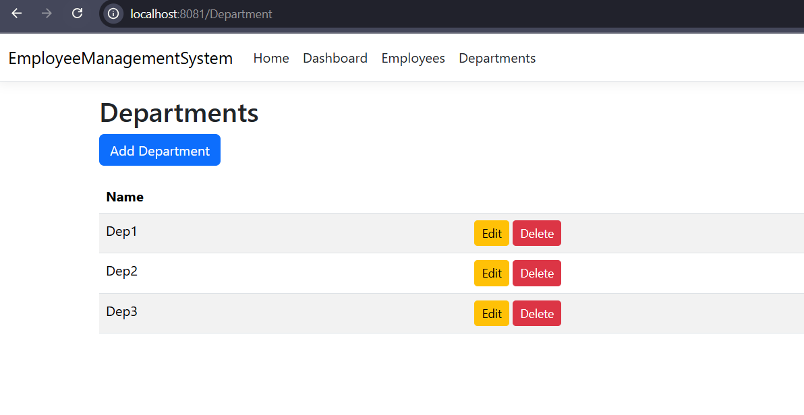
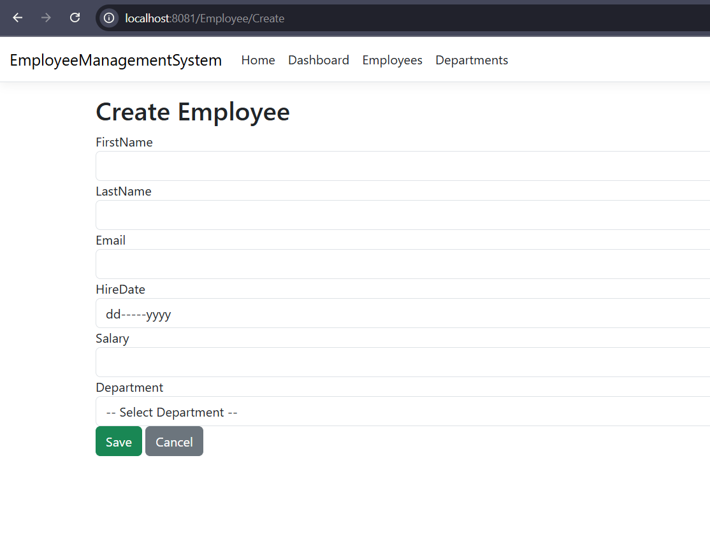
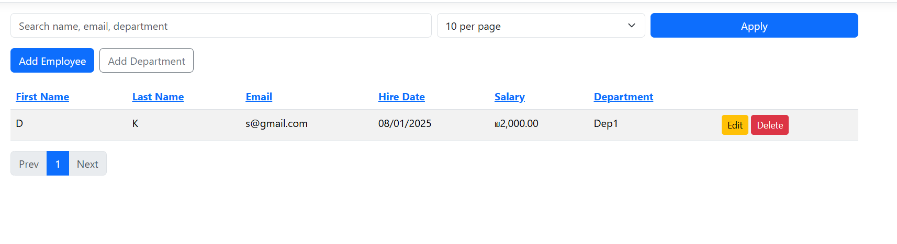
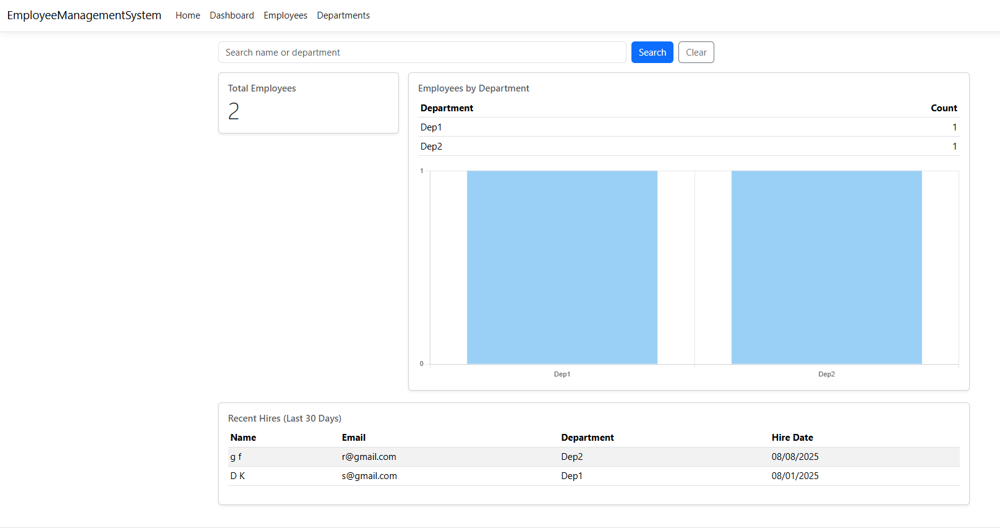

# Employee Management System - Developer Interview Task (2025 Edition) -- Slava Kagan

## -- Overview --

** A full-stack **ASP.NET Core MVC** Employee Management System with employee and department CRUD and basic Dashboard that showcases clean architecture layered design basic validation, pagination, structured logging and ships as a Docker container.

## -- DEMO --

## Department

## Employee

## Dashboard

## -- Contact --

**Full Name:** Slava Kagan
**Email:** <slava.kagan.ht@gmail.com>

## -- General info about the task and Tech Stack --

**GitHub repository:** https://github.com/SlavaKagan/EmployeeManagementSystem  
**Programming Language:** C# <https://learn.microsoft.com/en-us/dotnet/csharp/>  
**Framework:** .NET8 <https://dotnet.microsoft.com/en-us/>  
**Database- Entity Framework Core:** (SQL Server) - LocalDB ((localdb)\MSSQLLocalDB)  
**Database Name:**  EmployeeDB  

** 

## -- How to use this service || Prerequisites --

1. Docker Desktop, Install- https://www.docker.com/products/docker-desktop/
2. GIT Install -https://git-scm.com/
3. Open IDE- Visua Studio Code or Visual Studio
4. git clone https://github.com/SlavaKagan/EmployeeManagementSystem.git
   cd EmployeeManagementSystem
5. From the project root (where docker-compose.yml is located), run:
docker-compose up --build
6. Access the Site-
Open a browser and go to: http://localhost:8081
The API should be running and connected to the SQL Server container.
7. At the end of use, stop the Site -- docker-compose down

** The DB loads automatically through the Docker settings

## -- Architecture rationale --

*API-
ASP.NET Core MVC controllers + Razor views.
Orchestrates requests, model binding, and validation surfacing.
ExceptionHandlingMiddleware for friendly errors, and Serilog request logging.

*Application-
Use cases implemented as *Service classes behind I*Service interfaces.
Accept/return DTOs, not EF entities.
FluentValidation enforces business/field rules (server-side).
AutoMapper maps DTOs ⇄ domain entities.
Common helpers: PagedResult<T> for paging/sorting/search.

*Domain-
Persistence-agnostic entities (Employee, Department) and simple invariants.
Optional base entity for audit columns (CreatedAt, UpdatedAt, IsDeleted).
No framework dependencies.

*Infrastructure-
EF Core AppDbContext and repositories (*Repository) behind interfaces.
Soft delete (boolean field): IsDeleted column + query filters or explicit Where(e => !e.IsDeleted).
Migrations, connection strings, and data access optimizations.
Registered via DI; can be swapped without touching upper layers.

*GitHub Actions workflow compiling & running tests on push - github/workflows/ci.yml

## -- Optimize the system+Future tasks --

** In order to make the system better and to improve it I thought on few things that I would done if i had more time to implement

1. Test Reference and Automation
   * Unit Test
   * Integration Tests
2. Add more important logs through the system+ Performance Monitoring
3. Security- Authentication and Authorization
4. API Versioning
5. Better UI styling
6. Caching
7. Terraform to deploy to AWS
8. Upload the system to server like Render- A free one

## -- License --

* Arbox Company Task
